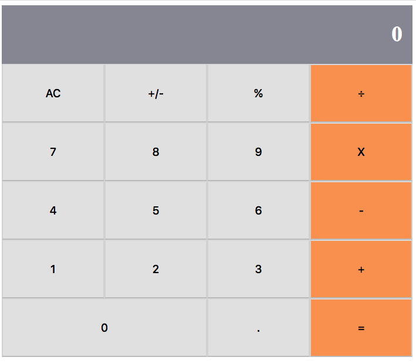

# Maya's React Calculator

> This is a simple calculator app built using React. It's a simple calulator app for a Math-magiciand, a fictional company based in France. The app is meant to assist them with their calculations. The app is not meant only to be fully-functional but have a beatiful UI and good UX.

It can successfully add, subtract, divide, multiply, find modulus and change sign of any given set of numbers inputted.

## Built With

- JavaScript (ES6),
- React ([Create React App](https://facebook.github.io/create-react-app)), 
- npm, eslint

## Live Demo
[Live Demo Link](https://mayareactcalculator.herokuapp.com/)

## Getting Started

To get a local copy up and running follow these simple example steps.

### Prerequisites
You will need to have a recent version of [Node.js](https://nodejs.org/en/), [React](https://reactjs.org/docs/create-a-new-react-app.html#create-react-app) and optionally [eslint]() installed.

### Setup
run `git clone https://github.com/mcrd25/react-calculator.git`  
run `cd react-calculator`
### Install
run `npm install`
### Usage
run `yarn start` to launch app in development mode  
run `yarn build` to build app for production

### Deployment
App deployed on heroku using [create-react-app-buildpack](https://github.com/mars/create-react-app-buildpack) for heroku.

## Authors

👤 **Maya Douglas (mcrd25)**

- Github: [@mcrd25](https://github.com/mcrd25)
- Twitter: [@mcrd25](https://twitter.com/mcrd25)
- Linkedin: [linkedin](https://linkedin.com/in/mayadouglas)

## 🤝 Contributing

Contributions, issues and feature requests are welcome!

Feel free to check the [issues page](issues/).

## Show your support

Give a ⭐️ if you like this project!

## Acknowledgments
- The app was built using following instructions [this repo](https://github.com/microverseinc/project-react-calculator)

## 📝 License

This project is [MIT](LICENSE) licensed.
